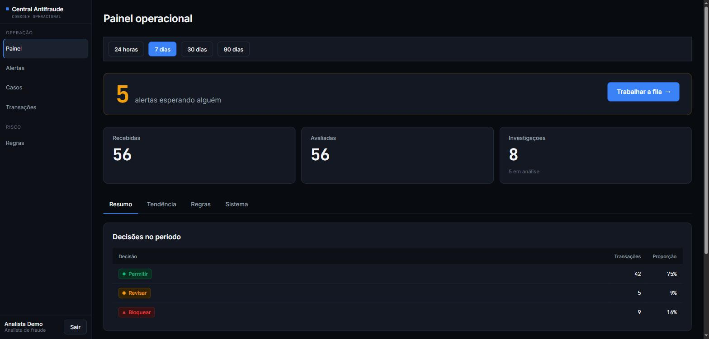
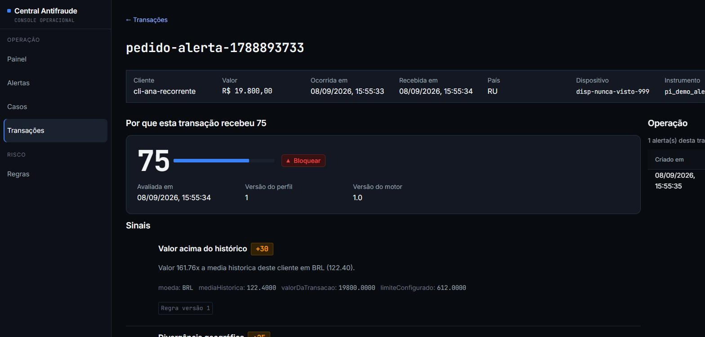
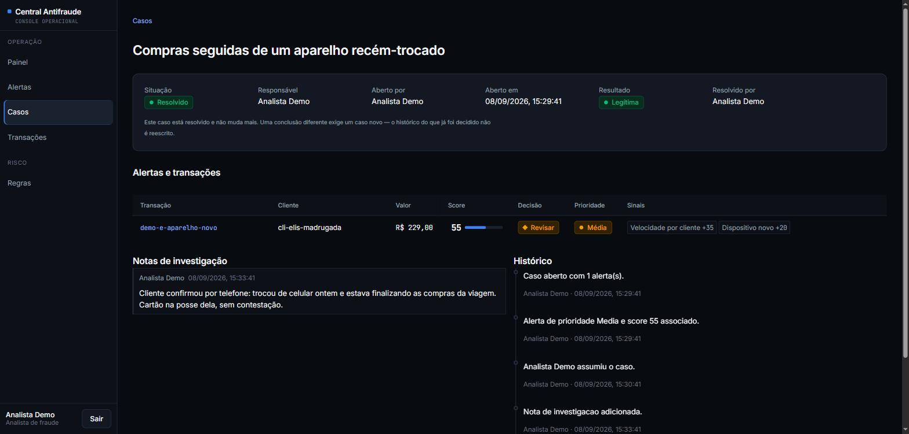

# Central Antifraude

Plataforma B2B para avaliação de risco, monitoramento e investigação de
transações suspeitas em pagamentos digitais.

> A Central Antifraude recebe transações de pagamentos digitais, avalia risco
> de forma determinística e explicável, retorna uma decisão imediata e processa
> os efeitos operacionais de forma assíncrona, idempotente e auditável.

**A plataforma não processa dinheiro.** Ela recomenda uma ação de risco —
`Permitir`, `Revisar` ou `Bloquear` — e oferece as ferramentas para um analista
humano investigar o que ficou em dúvida. Não é banco, gateway, adquirente nem
solução certificada de compliance.

---

## Estado atual

| Fase | Nome | Status |
|---|---|---|
| 0 | Fundação Técnica | ✅ concluída |
| 1 | Identidade e Multi-tenancy | ✅ concluída |
| 2 | Integrações e Ingestão | ✅ concluída |
| 3 | Motor de Risco v1 | ✅ concluída |
| 4 | Avaliação Síncrona e Concorrência | ✅ concluída |
| 5 | Backbone Assíncrono | ✅ concluída |
| 6 | Alertas Operacionais | ✅ concluída |
| 7 | Casos e Investigação | ✅ concluída |
| 8 | Gestão e Versionamento de Regras | ✅ concluída |
| 9 | Backtests | ✅ concluída |
| 10 | Operação, Busca, Painel e Auditoria | ✅ concluída |
| 11 | Hardening de Segurança Aplicacional | ✅ concluída |
| 12 | Observabilidade, Resiliência e Performance | ✅ concluída |
| 13 | Dados de Demonstração e UX Final | ✅ concluída |
| 14 | Infraestrutura, Custo e Deploy | ✅ concluída — **em produção** |
| **15** | **Validação Final, Pentest e Release** | 🟨 validada; falta a release `v1.0.0` |

Hoje a plataforma recebe transações de sistemas externos autenticados por
credencial própria, registra cada tentativa **exatamente uma vez** mesmo sob
requisições simultâneas, **avalia o risco na mesma operação** e devolve
`Permitir`, `Revisar` ou `Bloquear` com os sinais que justificam a decisão.

O motor é determinístico e versionado: a mesma transação, o mesmo histórico e a
mesma versão de perfil produzem sempre o mesmo resultado. Cada avaliação grava a
versão do perfil e a versão de cada regra acionada, e o banco recusa apagar o
que sustenta uma decisão — uma avaliação de meses atrás continua explicável pela
configuração daquele momento.

Tudo isso acontece **em uma única transação serializável**, com retry
deliberado: transações simultâneas do mesmo cliente produzem um resultado
equivalente a alguma ordem serial válida, e um retry do integrador devolve a
avaliação original em vez de recalcular. Cada avaliação grava também um evento
na Outbox, no mesmo commit — a publicação chega na Fase 5.

Depois de responder, o evento sai pelo caminho assíncrono: a Outbox é
publicada em uma fila, um worker consome e aplica os efeitos **uma vez** — mesmo
com entrega repetida, processo caindo no meio ou vários despachantes ao mesmo
tempo. Um desses efeitos é a **fila de alertas**: uma avaliação `Revisar` ou
`Bloquear` vira trabalho na mesa do analista, filtrável, ordenável e a um
clique da transação que a originou.

Da fila, um analista abre um **caso**: assume, anota e conclui como fraude
confirmada, legítima ou inconclusiva. A conclusão humana não reescreve a decisão
do motor — uma transação pode ter recebido `Revisar` e terminar como legítima, e
isso é um falso positivo legítimo, não um defeito. Cada ação fica numa timeline
que não se edita, e o veredito vira dado por transação.

O Supervisor administra as regras que produzem tudo isso: escreve um rascunho,
publica uma versão imutável e ajusta os limiares. Nada disso reescreve o
passado — uma transação avaliada em março continua explicada pela regra que
valia em março. Antes de publicar, ele mede: um **backtest** reaplica a regra
candidata sobre o histórico, no mesmo motor da avaliação real, sem tocar em
produção. E acompanha a operação por um **painel** e por um **console** de
transações, alertas e casos com filtros tipados.

Tudo isso está **no ar**: a plataforma foi implantada em produção — API
serverless na AWS, banco gerenciado no Neon, frontend na Vercel — com custo
esperado de **US$ 0,00** para uso de portfólio. Ver [Demonstração ao vivo](#demonstração-ao-vivo).

---

## Demonstração ao vivo

Capturas do ambiente publicado, como Analista de Fraude — a galeria completa em
[`docs/screenshots/`](docs/screenshots/):

| Painel | Transação explicável | Falso positivo |
|---|---|---|
|  |  |  |

| | |
|---|---|
| **Aplicação** | https://central-antifraude.vercel.app |
| **API** | Lambda Function URL (`us-east-1`), atrás do frontend |
| **Perfis da demo** | Administrador · Analista de Fraude · Supervisor · Auditor |

A demonstração tem uma narrativa: seis histórias plantadas no seed, incluindo
**um falso positivo obrigatório** — uma transação que o motor marcou `Revisar`
e a investigação humana concluiu `Legítima`. É o caso que justifica por que a
investigação existe. O roteiro está em [`docs/demonstracao.md`](docs/demonstracao.md).

> A infraestrutura suspende sozinha quando ociosa (é o que sustenta o custo
> zero). A primeira visita depois de um tempo parado leva ~4 s para acordar
> banco e função; as seguintes respondem em ~0,6 s.

---

## Stack

**Backend** — C#, .NET 10, ASP.NET Core (Minimal APIs), Entity Framework Core
**Frontend** — React 19, TypeScript, Vite, TanStack Query, React Router
**Banco** — PostgreSQL 17
**Testes** — xUnit v3, Testcontainers, Vitest, Testing Library

---

## Estrutura

```text
src/
  CentralAntifraude.Domain/          invariantes e primitivos — zero dependência
  CentralAntifraude.Application/     contratos e casos de uso
  CentralAntifraude.Infrastructure/  PostgreSQL, EF Core, relógio
  CentralAntifraude.Api/             composição HTTP

tests/
  CentralAntifraude.UnitTests/         domínio, aplicação, contrato de erro
  CentralAntifraude.IntegrationTests/  PostgreSQL real, isolamento e Security Gates
  CentralAntifraude.ArchitectureTests/ regras de dependência entre camadas

frontend/                            shell React + Vite

docs/
  adr/                               decisões arquiteturais
  setup-local.md                     como rodar
  security-gate-0.md                 resultado do gate da Fase 0
  security-gate-1.md                 resultado do gate da Fase 1
  security-gate-2.md                 resultado do gate da Fase 2
  security-gate-3.md                 resultado do gate da Fase 3
  security-gate-4.md                 resultado do gate da Fase 4
  security-gate-5.md                 resultado do gate da Fase 5
  security-gate-6.md                 resultado do gate da Fase 6
  security-gate-7.md                 resultado do gate da Fase 7
  security-gate-8.md                 resultado do gate da Fase 8
  security-gate-9.md                 resultado do gate da Fase 9
  security-gate-10.md                resultado do gate da Fase 10
  security-gate-11.md                resultado do gate da Fase 11
  security-gate-12.md                resultado do gate da Fase 12
  security-gate-13.md                resultado do gate da Fase 13
  demonstracao.md                    o roteiro da demo, em 8 minutos
  threat-model.md                    fluxos, ameaças e mitigações
  matriz-de-autorizacao.md           quem alcança o quê
  observabilidade.md                 catálogo de logs e métricas, runbook da DLQ
  baseline-de-performance.md         números medidos do caminho crítico
```

A dependência corre em uma direção só, e testes de arquitetura seguram isso:

```text
Api  ──────►  Application  ──────►  Domain
 │                                    ▲
 └──────►  Infrastructure  ───────────┘
```

---

## Executar

Guia completo em [`docs/setup-local.md`](docs/setup-local.md), incluindo as
armadilhas conhecidas de ambiente Windows.

```bash
cp .env.example .env          # ajuste POSTGRES_PASSWORD
docker compose up -d

export ConnectionStrings__Postgres="Host=localhost;Port=5434;Database=central_antifraude;Username=central_antifraude;Password=SUA_SENHA"
dotnet tool restore
dotnet dotnet-ef database update --project src/CentralAntifraude.Infrastructure

dotnet run --project src/CentralAntifraude.Api    # http://localhost:5175
cd frontend && npm install && npm run dev         # http://localhost:5174
```

A string de conexão **não** está em nenhum arquivo versionado. Sem ela, a API
não sobe — e diz o motivo.

### Endpoints

Rotas de aplicação ficam sob `/api`; `/health/*` fica na raiz, porque é
consumido por orquestrador e não pela interface.

| Rota | Perfil | O que faz |
|---|---|---|
| `GET /health/live` | anônimo | o processo está vivo. Não toca em dependência externa. |
| `GET /health/ready` | anônimo | as dependências respondem. Pode falhar sozinho. |
| `POST /api/auth/login` | anônimo | autentica e emite a sessão |
| `POST /api/auth/refresh` | cookie | rotaciona a sessão |
| `POST /api/auth/logout` | cookie | encerra a sessão |
| `GET /api/auth/eu` | qualquer | dados da própria sessão |
| `GET /api/usuarios` | Administrador | lista os usuários da organização |
| `POST /api/usuarios` | Administrador | cria usuário |
| `PUT /api/usuarios/{id}/perfil` | Administrador | altera perfil e corta sessões |
| `PUT /api/usuarios/{id}/ativacao` | Administrador | ativa/desativa e corta sessões |
| `PUT /api/usuarios/{id}/senha` | Administrador | redefine senha |
| `PUT /api/usuarios/{id}/nome` | Administrador | altera nome |
| `GET /api/integracoes` | Administrador | lista integrações |
| `POST /api/integracoes` | Administrador | cria integração e emite a primeira chave |
| `GET /api/integracoes/{id}` | Administrador | integração e suas credenciais |
| `POST /api/integracoes/{id}/credenciais` | Administrador | emite chave para rotação |
| `DELETE /api/integracoes/{id}/credenciais/{cid}` | Administrador | revoga uma chave |
| `PUT /api/integracoes/{id}/ativacao` | Administrador | ativa/desativa e revoga chaves |
| `GET /api/transacoes` | qualquer | transações da organização, com score e decisão |
| `GET /api/transacoes/{id}` | qualquer | detalhe com a avaliação e os sinais |
| `GET /api/regras` | qualquer | catálogo de regras em vigor |
| `GET /api/regras/perfil` | qualquer | perfil vigente, com os limiares |
| `GET /api/alertas` | qualquer | fila operacional, com filtros, ordenação e paginação |
| `GET /api/casos` | qualquer | investigações da organização, com filtros |
| `GET /api/casos/{id}` | qualquer | workspace: alertas, sinais, timeline, notas e ações permitidas |
| `POST /api/casos` | Operação | abre um caso a partir de alertas |
| `POST /api/casos/{id}/assumir` | Operação | assume o caso para si |
| `POST /api/casos/{id}/transferir` | Supervisor | passa o caso para outra pessoa |
| `POST /api/casos/{id}/alertas` | Operação | traz mais um alerta para o caso |
| `POST /api/casos/{id}/notas` | Operação | acrescenta uma nota de investigação |
| `POST /api/casos/{id}/resolucao` | Operação | conclui a investigação |
| `GET /api/regras/tipos` | Supervisão | catálogo fechado, com os campos de cada tipo |
| `GET /api/regras/gestao` | Supervisão | todas as regras, com rascunho e situação |
| `GET /api/regras/{id}` | Supervisão | uma regra, com o histórico de versões |
| `POST /api/regras` | Supervisão | cria uma regra como rascunho |
| `PUT /api/regras/{id}/rascunho` | Supervisão | grava o rascunho |
| `DELETE /api/regras/{id}/rascunho` | Supervisão | descarta o rascunho |
| `POST /api/regras/{id}/publicacao` | Supervisão | congela o rascunho em versão |
| `POST /api/regras/{id}/ativacao` | Supervisão | liga ou desliga a regra |
| `POST /api/regras/perfil/limiares` | Supervisão | publica limiares novos |
| `POST /api/ingestao/transacoes` | **`ApiKey`** | recebe uma tentativa de pagamento e devolve a decisão de risco |

A ingestão pode responder **503 com `Retry-After`** quando a disputa por
concorrência passa do orçamento de retentativas. É um convite explícito a
repetir com a mesma chave de idempotência, e não um erro do servidor.

A ingestão usa esquema de autenticação **próprio** (`Authorization: ApiKey ...`):
integração não é usuário, e um token humano não serve ali — nem o contrário.

---

## O motor de risco

Quatro regras, um catálogo **fechado e tipado**. Não há DSL, SQL configurável
nem script de usuário: configurar uma regra é escolher números dentro de um
contrato conhecido, e um tipo desconhecido lido do banco **falha alto** em vez
de virar comportamento.

| Regra | O que reconhece | Peso (demo) | Configuração (demo) |
|---|---|---|---|
| Velocidade por cliente | várias tentativas em sequência — o padrão de *card testing* | 35 | mais de 3 em 10 min |
| Dispositivo novo | aparelho nunca visto para aquele cliente | 20 | mínimo 3 no histórico |
| Valor acima do histórico | gasto muito acima do habitual daquele cliente | 30 | 5× a média, mínimo 3 |
| Divergência geográfica | país diferente dos já vistos | 25 | mínimo 3 no histórico |

| Score | Decisão |
|---|---|
| 0–39 | Permitir |
| 40–69 | Revisar |
| 70–100 | Bloquear |

As **práticas** são reais e têm fonte: U.S. Payments Forum, *"Card-Not-Present
(CNP) Fraud Mitigation Techniques"* (2020) — a citação de cada regra está no
[ADR 0008](docs/adr/0008-motor-de-risco.md).

Os **números** não são. Pesos e limiares são configuração de demonstração deste
projeto, escolhidos para que uma regra sozinha nunca bloqueie: bloquear exige ao
menos duas evidências independentes, para que a investigação humana continue
tendo propósito. Apresentá-los como padrão de mercado seria inventar.

Três propriedades que o produto garante e testa:

- **IA não participa.** Score, sinais e o texto de cada explicação são
  produzidos por código determinístico.
- **Ausência de dado não vira risco.** Sem fingerprint, sem país ou com
  histórico curto demais, a regra se cala. Tratar "não sei" como "suspeito"
  encheria a fila do analista de alertas que não dizem nada.
- **Retry não recalcula.** A mesma requisição repetida devolve a avaliação
  original, lida do banco — o mesmo pedido nunca recebe duas decisões
  diferentes.

---

## Concorrência

A avaliação lê um **conjunto** — quantas transações daquele cliente na janela — e
decide a partir dele. Duas requisições simultâneas, cada uma sem enxergar a
outra, produziriam duas avaliações que nenhuma execução sequencial produziria.

A ingestão roda numa transação **`SERIALIZABLE`**, e só ela: login, consultas e
administração não dependem de um conjunto lido para estarem corretos. Em
conflito reconhecido, a operação **inteira** é refeita — releitura do contexto e
nova avaliação, nunca a repetição do comando SQL que falhou.

O que o sistema promete, e o que não promete:

- ✅ o resultado equivale a **alguma** ordem serial válida das operações
  simultâneas;
- ❌ não se promete que toda requisição enxergue as simultâneas — isso seria
  exigir que ela enxergasse o futuro.

A prova é exata. Seis transações do mesmo cliente, com o mesmo horário de
ocorrência, enviadas ao mesmo tempo: as contagens de janela registradas têm que
ser {1..6}, sem repetido e sem buraco. Um repetido significaria duas transações
que não enxergaram uma à outra.

Quando a disputa passa do orçamento de retentativas, a resposta é **503 com
`Retry-After`** — e não 500. Repetir com a mesma chave de idempotência é seguro
por construção.

Os números medidos estão em
[`docs/baseline-de-performance.md`](docs/baseline-de-performance.md): p50 de
15 ms, p99 de 40 ms e 8 comandos SQL por ingestão.

---

## O caminho assíncrono

A decisão sai na resposta. O **efeito** sai depois — e é aí que entram as três
peças que fazem um sistema de eventos ser confiável em vez de otimista.

```text
avaliação + evento          um commit só (Outbox)
        ↓
despachante                 publica, depois marca
        ↓
fila                        entrega ao menos uma vez, sem ordem
        ↓
worker                      Inbox + efeito, um commit só
        ↓
confirma na fila            só depois do commit
```

Cada ordem acima é uma escolha, e a escolha oposta tem um custo conhecido:

| Escolha | Se fosse ao contrário |
|---|---|
| Publicar **antes** de marcar | mensagem perdida para sempre, em vez de duplicata |
| Confirmar **depois** do commit | efeito perdido, em vez de reentrega |
| Inbox no **mesmo** commit do efeito | existiria o instante em que o efeito aconteceu e a marca não |

**A promessa não é entrega única — essa ninguém cumpre. É efeito único.** O
efeito escolhido para provar isso é um contador de decisões por dia, e a
escolha é deliberada: somar duas vezes não deixa rastro nenhum. Um efeito com
chave única passaria mesmo com a Inbox desligada, porque o banco seguraria a
duplicata.

A fila é PostgreSQL até a Fase 14, reproduzindo o contrato do SQS Standard —
visibilidade, recibo por entrega, contagem de recebimentos e redrive para DLQ.
Ela é testada por um conjunto que **não cita PostgreSQL**, para que a troca pelo
SDK seja um adaptador e não uma reescrita. Detalhes no
[ADR 0010](docs/adr/0010-backbone-assincrono.md).

---

## A fila de alertas

O mesmo evento produz **dois efeitos**: o contador diário e o alerta. Não são
duas filas — é um processo que lê uma vez e aplica os dois na mesma transação,
cada um com sua própria marca na Inbox. A chave é `(consumidor, evento)`, e é
ela que permitirá separá-los em processos distintos sem mudar nada da semântica.

```text
Permitir → nenhum alerta
Revisar  → alerta, prioridade Média
Bloquear → alerta, prioridade Alta
```

A política **não reavalia risco**. Ela lê a decisão que o motor já tomou e
responde uma pergunta operacional: isto precisa de olho humano, e com que
urgência? Reavaliar produziria um resultado possivelmente diferente do que o
integrador recebeu na resposta síncrona — o painel discordaria do recibo. Os
limiares e pesos são **configuração de demonstração**, não prática de mercado.

O alerta é protegido por **duas camadas de idempotência**: a Inbox e a restrição
única de `avaliacao_id`. Dois testes derrubam uma de cada vez, porque uma
proteção nunca exercitada é uma proteção que ninguém sabe se existe.

E a fila é **somente leitura**: nenhuma rota cria, altera, atribui ou apaga
alerta, e o Security Gate 6 verifica a ausência com sete métodos e caminhos. A
ação humana pertence ao caso. Detalhes no
[ADR 0011](docs/adr/0011-alertas-operacionais.md).

---

## A investigação humana

Um caso nasce **de alertas** — nunca vazio. Sem alerta não há transação para
investigar nem resultado para registrar, e o produto recusa virar um sistema de
tickets.

```text
Novo  →  EmAnalise  →  Resolvido
```

`Novo → EmAnalise` acontece por consequência de assumir, e não por um botão
separado. **Resolvido é imutável**: não há reabertura, nota depois da conclusão
nem troca de responsável. A razão é a Fase 9 — ela usa o resultado humano como
verdade para comparar regras candidatas, e um veredito que muda depois faria
backtests antigos passarem a mentir.

**Cada ação muda o estado e deixa uma entrada na timeline, na mesma operação.**
Um caminho que mudasse o estado sem registrar produziria um caso cuja história
não explica o próprio estado. A trilha é ordenada por sequência, e não por
horário: abrir um caso grava dois eventos no mesmo instante.

**Duas pessoas ao mesmo tempo não se sobrescrevem.** Toda ação envia a versão
que a tela leu; a aplicação recusa a versão velha, e o banco arbitra a corrida
real com um token de concorrência. Duas resoluções simultâneas produzem
exatamente um `200` e um `409`.

**Notas são texto, e o sistema não as altera.** Marcação é recusada com
explicação, nunca limpa em silêncio — uma nota alterada pelo sistema deixa de
ser o que o analista escreveu. A defesa contra XSS é a saída: a tela renderiza
texto.

Ao resolver, o veredito vira uma linha **por transação**, com restrição única.
É essa base que a Fase 9 vai comparar contra regras candidatas. Detalhes no
[ADR 0012](docs/adr/0012-casos-e-investigacao.md).

---

## As regras, e o que impede o passado de mudar

Uma regra tem duas partes, e a diferença entre elas é a promessa central do
produto:

| | Muda? | O que é |
|---|---|---|
| A **regra** | sim | a identidade: nome, ativação e o **rascunho** em preparo |
| A **versão publicada** | **nunca** | a configuração e o peso congelados |

```text
Rascunho  →  Publicada (v1)  →  novo rascunho  →  Publicada (v2)
```

A versão publicada não tem método de alteração, não tem propriedade gravável e
não tem rota — e um teste de arquitetura verifica que continua assim. É ela que
responde "por que esta decisão foi tomada naquele momento" para cada avaliação
que a usou.

**Uma única coisa muda o que o motor executa: publicar uma versão de perfil.**
Publicar uma regra, ligá-la, desligá-la ou mexer nos limiares terminam todas
publicando um perfil novo, na mesma transação. Assim a tela de regras é uma
descrição fiel do que está rodando — não existe "publicado mas sem efeito".

**Configurar não é programar.** O catálogo de tipos é fechado: a API recebe um
tipo conhecido e um punhado de números nomeados, e um `switch` em C# constrói o
contrato tipado. Campo desconhecido, campo faltando e valor fora da faixa são
recusados com `400`. Não há expressão, SQL nem script em ponto nenhum.

O formulário da tela é montado a partir de `/api/regras/tipos` — rótulo, faixa e
valor padrão vêm do servidor, e não de uma segunda lista no frontend que sairia
de sincronia.

**Dois supervisores não se sobrescrevem.** Toda ação envia a versão que a tela
leu; a numeração de versões é única no banco, e é ela que arbitra duas
publicações simultâneas. Detalhes no
[ADR 0013](docs/adr/0013-gestao-e-versionamento-de-regras.md).

---

## Backtest: medir antes de publicar

Publicar uma regra alcança **toda transação que entrar depois**. O backtest
responde, antes disso, quantas decisões mudariam — e como o candidato trataria
os casos que a equipe já investigou.

```text
POST  →  candidato congelado + evento, na mesma transação
      →  fila dedicada de backtests
      →  worker
      →  o MESMO motor, duas vezes por transação: vigente e candidato
      →  documento de apuração
```

**Não existe um segundo motor.** O que muda é de onde vem o perfil — um
candidato montado em memória, nunca gravado — e de onde vem o contexto
histórico, lido de uma vez em vez de uma consulta por avaliação. Que o recorte é
fiel não é promessa: uma execução cujo candidato é igual ao perfil vigente
precisa reproduzir, decisão a decisão, as avaliações que ficaram gravadas na
ingestão. Um teste de arquitetura recusa um `BacktestRiskEngine`.

**Simulação não vira dado operacional.** Um backtest não altera avaliação, não
cria alerta, não cria caso e não publica evento operacional. As contagens são
conferidas no banco antes e depois de cada execução do teste.

**Contagens, e nunca precisão nem recall.** O resultado cruza o veredito humano
com o que cada perfil decidiria, com o denominador de cada linha à vista — e
"sem investigação" é uma linha distinta de "inconclusiva". A maioria das
transações nunca foi investigada, e as que foram não são amostra aleatória:
chamar isso de taxa de detecção seria afirmar o que os dados não sustentam.

Cinco limites impedem que um clique custe caro: janela, volume analisado, volume
de contexto, execuções simultâneas por organização e tempo máximo. Todos
recusam em vez de truncar. Detalhes no
[ADR 0014](docs/adr/0014-backtests.md).

---

## O console operacional

O analista abre o expediente no **painel** e trabalha no **console de
transações**. Os dois só mostram números que levam a uma decisão.

**Recebidas e avaliadas são números diferentes, e a tela diz por quê.** Uma
transação atrasada chega hoje sobre um fato de ontem: o console filtra pela
ocorrência — "o que aconteceu na terça" —, e o painel conta pela avaliação — "o
que foi decidido hoje". Igualá-los esconderia o comportamento que o produto
existe para tratar.

O console filtra por busca, decisão, tipo de sinal, faixa de score e período,
ordena por quatro colunas e pagina — **tudo no servidor, numa consulta só**. O
total acompanha o filtro: contar antes de filtrar daria páginas vazias no fim, e
esse é o tipo de defeito que ninguém reporta e todo mundo desconfia.

**Nada do que o cliente digita vira SQL.** O campo de ordenação vem de lista
fechada, decisão e tipo de regra são vocabulários fechados — `decisao=2` é
recusado, e não interpretado como `Revisar` —, e a busca livre é casada como
literal, com os curingas de `LIKE` escapados. Um `%` digitado por engano
devolveria a tabela inteira e a tela pareceria filtrada: pior do que um erro,
porque uma lista cheia não levanta suspeita.

**As métricas de regra são contagens, e nunca taxa de acerto.** O painel mostra
quantas vezes cada regra acionou e o que a investigação humana concluiu sobre
aquelas transações — com o denominador à vista. As transações investigadas não
são amostra aleatória: viraram caso justamente porque o motor as marcou.

A **trilha de auditoria**, gravada desde a Fase 1, virou consultável — por
Administrador e Auditor, e por mais ninguém. Ela é um controle sobre quem opera,
e não há rota que a altere. Detalhes no
[ADR 0015](docs/adr/0015-console-operacional.md).

---

## Segurança: o que está escrito e o que é verificado

Segurança apareceu em todas as fases — cada uma tem o seu Security Gate em
`docs/`. O que a Fase 11 consolidou foram as duas coisas que só aparecem
olhando o conjunto.

**O [modelo de ameaças](docs/threat-model.md)** cobre sete fluxos — navegador,
integração, banco, Outbox, fila, supervisão de regras e auditoria — e cada
linha tem ameaça, mitigação e o teste que a prova. As ameaças fora de escopo
estão nomeadas, para não serem confundidas com cobertura.

**A [matriz de autorização](docs/matriz-de-autorizacao.md) é um teste, e não um
documento.** A tabela declarada é comparada com as rotas que a aplicação
realmente expõe, lidas do roteamento: uma rota nova sem entrada quebra a build,
e uma entrada sem rota também. O risco que isso fecha não é uma rota mal
protegida — é a próxima rota.

A invariante menos óbvia da matriz é a mais útil: **nenhuma rota de escrita pode
carregar `perfil:qualquer`**, porque essa política inclui o Auditor, cujo perfil
é de leitura. Lendo a rota isoladamente, ninguém perceberia.

O isolamento entre organizações tem varredura própria: um recurso de cada
família nasce no tenant B pelo caminho real do produto, cada identificador passa
pela API do tenant A, e o estado de B é conferido **no banco** depois — um `404`
devolvido *depois* de gravar seria pior do que um `200`.

---

## Operação: seguir uma transação de ponta a ponta

Toda requisição recebe um `CorrelationId`, que volta no cabeçalho da resposta e
acompanha a operação até o efeito — inclusive **através do processo de fundo**,
que é onde esse tipo de rastro costuma arrebentar. Quatro linhas de log, em dois
processos diferentes, carregam o mesmo identificador: a requisição, a publicação
na fila, o efeito aplicado pelo worker e o alerta criado.

O teste que garante isso lê **log**, e não banco. O banco já provava a cadeia
desde a Fase 5; o que faltava era exatamente aquilo que ele não pode mostrar.

O produto emite 17 métricas em 5 medidores, e as dimensões que elas podem
carregar são uma **lista de permissão** — `decisao`, `prioridade`, `resultado`,
`operacao`, `fila`, `laco`. Uma métrica nova com dimensão fora dessa lista
quebra a build, e quem a criou precisa declarar quantos valores ela pode ter. O
risco fechado não é uma métrica cara que existe hoje; é a próxima.

Duas escolhas que parecem detalhe e não são:

- **a operação registrada é o padrão da rota**, `GET /api/casos/{id}`, e nunca o
  caminho concreto. Métrica não tem tenant nem autorização, e o caminho carrega
  identificador de recurso de um cliente;
- **não existe rota de métricas.** Profundidade de Outbox e de fila são números
  do processo, e não de uma organização: devolvê-los ao administrador de um
  tenant contaria a ele o volume de trabalho dos outros.

Catálogo completo, sinais que valem alarme e o procedimento de fila de mortas em
[`docs/observabilidade.md`](docs/observabilidade.md). Decisões no
[ADR 0016](docs/adr/0016-observabilidade-e-resiliencia.md).

---

## Performance: o que foi medido, e o que a medição revelou

Quatro cenários de carga em
[`docs/baseline-de-performance.md`](docs/baseline-de-performance.md) — throughput
normal, cliente quente, tempestade de idempotência e acúmulo assíncrono. O
caminho crítico responde com p50 de **19 ms**, e vinte e cinco repetições
simultâneas da mesma requisição custam o que **uma** custa.

O resultado mais interessante é o que não fazia sentido: clientes
**independentes** entrando em contenção de serialização. A causa não está no
domínio, e sim no plano de execução — com a tabela pequena, o PostgreSQL escolhe
varredura sequencial, e sob `SERIALIZABLE` isso toma predicado sobre a relação
inteira, fazendo todos conflitarem com todos. Com volume, o índice é escolhido e
o efeito some. Está medido, explicado por `EXPLAIN` e registrado.

**Nenhum índice novo foi criado**: a evidência disse que os existentes bastam. E
o checkpoint de Redis do roadmap foi respondido com número, e não com opinião —
[ADR 0017](docs/adr/0017-sem-redis.md).

---

## A demonstração

O banco de desenvolvimento não é ruído: são **seis histórias escritas para
serem entendidas** — movimento normal, compra atípica bloqueada, rajada,
sinal isolado que *não* alarma, falso positivo resolvido como legítima e um
caso aberto com dois alertas.

**As decisões não estão escritas à mão.** O seed monta a transação, monta o
contexto histórico e pergunta ao motor de risco de verdade, com a versão de
perfil publicada de verdade. Mexer no peso de uma regra muda os números da
demonstração junto — que é o único jeito de ela não virar mentira.

Isso tem um preço, e ele apareceu: três histórias não saíram como planejadas.
Duas viraram conteúdo em vez de defeito — **um sinal sozinho não alcança o
limiar**, nem o geográfico (+25) nem o de velocidade (+35). Sem um caso assim,
quem vê o produto conclui que todo sinal vira alerta.

O roteiro de oito minutos está em [`docs/demonstracao.md`](docs/demonstracao.md),
e oito testes garantem que as histórias continuam acontecendo.

---

## Testes

```bash
dotnet test tests/CentralAntifraude.UnitTests/CentralAntifraude.UnitTests.csproj
dotnet test tests/CentralAntifraude.ArchitectureTests/CentralAntifraude.ArchitectureTests.csproj
dotnet test tests/CentralAntifraude.IntegrationTests/CentralAntifraude.IntegrationTests.csproj
cd frontend && npm run test
```

Os testes de integração sobem o próprio PostgreSQL via Testcontainers e exigem
Docker no ar. SQLite não é aceito como substituto: as fases seguintes dependem
de `SERIALIZABLE`, `FOR UPDATE SKIP LOCKED` e constraints que só o PostgreSQL
tem — um teste de concorrência verde no SQLite não provaria nada.

A suíte tem **1.211 testes** — 546 unitários, 51 de arquitetura, 480 de
integração, 134 de frontend. O número não é a meta; cobrir risco real é. Vários
testes nasceram de defeitos concretos, e cada um prova que falha sem a correção:
o `CorrelationId` que sumia num endpoint com tratador de exceção, a conexão
morta que o Neon fechava, o CORS declarado em dois lugares, o handler do Lambda
referenciado por string.

---

## Deploy e infraestrutura

A plataforma roda **serverless**, sem nenhum recurso de custo fixo:

```text
Vercel (frontend estático)
   │  HTTPS
   ▼
Lambda Function URL ──► API (.NET 10, arm64)
   │                       │
   │ commit               ▼
   │                    Neon PostgreSQL 17  (scale-to-zero em 5 min)
   ▼
Lambda despachante ──► SQS ──► Lambda consumidor ──► efeitos (alertas)
   ▲                    │
   │ a cada 15 min       └─► DLQ após 5 tentativas
EventBridge Scheduler
```

A infraestrutura é declarada em [`infra/template.yaml`](infra/template.yaml)
(AWS SAM) e sobe com `sam deploy`. Os segredos **não** estão no template nem em
variável de ambiente do Lambda: ficam no SSM Parameter Store como `SecureString`
e são lidos no arranque. Ver [ADR 0019](docs/adr/0019-deploy-serverless-e-despacho-imediato.md)
e [`docs/custo-e-infraestrutura.md`](docs/custo-e-infraestrutura.md).

**O despachante é acordado, não fica perguntando.** Um polling constante
manteria o Neon acordado 24/7 e estouraria o plano gratuito. Em vez disso, a API
invoca o despachante logo após o commit (alerta em segundos), e uma varredura de
15 minutos é a rede de segurança da Outbox. A garantia continua sendo a tabela;
a invocação imediata é só latência.

### Custo

**US$ 0,00 esperado** para o envelope de portfólio (~10 mil avaliações/mês). O
item mais apertado usa 16% da sua camada gratuita. Nenhum recurso cobra por
estar parado: sem NAT Gateway, sem RDS, sem API Gateway, sem chave KMS própria.
A conta inteira, com fontes de preço verificadas, está em
[`docs/custo-e-infraestrutura.md`](docs/custo-e-infraestrutura.md).

---

## Segurança verificada em produção

Além dos testes automatizados, a plataforma passou por um **pentest gray-box**
contra o ambiente publicado: 19 vetores da lista do ROADMAP — JWT forjado e
`alg=none`, replay de refresh com queda da família, tenant injection, mass
assignment, IDOR, escalonamento de privilégio, SQL injection, XSS, CSRF, rate
limiting e vazamento de segredo em erro. **Todos defendidos, nenhum achado de
alta severidade.** O relatório, com escopo e limitações — e a afirmação
explícita de que "100% seguro" não é uma alegação sustentável —, está em
[`docs/pentest-v1.md`](docs/pentest-v1.md).

Dependências: **zero vulnerabilidades** conhecidas nos dois ecossistemas, com
Dependabot vigiando semanalmente.

---

## Decisões já congeladas

| Decisão | Onde |
|---|---|
| Monólito modular em quatro projetos | [ADR 0001](docs/adr/0001-monolito-modular.md) |
| Identificadores internos são UUIDv7 | [ADR 0002](docs/adr/0002-identificadores-internos.md) |
| PostgreSQL real nos testes, via Testcontainers | [ADR 0003](docs/adr/0003-postgresql-e-testes-de-integracao.md) |
| UTC, dinheiro, erros, JSON, correlação, paginação | [ADR 0004](docs/adr/0004-contratos-transversais.md) |
| E-mail único global, filtro de tenant em duas camadas, prefixo `/api` | [ADR 0005](docs/adr/0005-identidade-e-multi-tenancy.md) |
| Tokens, hash de senha, CSRF e detecção de reuso | [ADR 0006](docs/adr/0006-sessao-humana.md) |
| Idempotência em três camadas, fingerprint canônico, credencial de integração | [ADR 0007](docs/adr/0007-ingestao-e-idempotencia.md) |
| Motor determinístico, catálogo fechado, explicabilidade gravada | [ADR 0008](docs/adr/0008-motor-de-risco.md) |
| `SERIALIZABLE` na ingestão, retry da operação inteira, Outbox | [ADR 0009](docs/adr/0009-operacao-critica-e-concorrencia.md) |
| Fila, envelope versionado, Inbox e DLQ | [ADR 0010](docs/adr/0010-backbone-assincrono.md) |
| Alertas: fan-out por manipulador, savepoint e duas camadas | [ADR 0011](docs/adr/0011-alertas-operacionais.md) |
| Casos: timeline append-only, resolvido imutável e lost update | [ADR 0012](docs/adr/0012-casos-e-investigacao.md) |
| Regras: rascunho, versão imutável e sucessão do perfil | [ADR 0013](docs/adr/0013-gestao-e-versionamento-de-regras.md) |
| Backtests: mesmo motor, candidato congelado e isolamento de produção | [ADR 0014](docs/adr/0014-backtests.md) |
| Console, painel e auditoria: filtro tipado, contagem ao vivo e trilha só de leitura | [ADR 0015](docs/adr/0015-console-operacional.md) |
| Observabilidade e resiliência: correlação ponta a ponta, métricas de baixa cardinalidade | [ADR 0016](docs/adr/0016-observabilidade-e-resiliencia.md) |
| Sem Redis: PostgreSQL como fonte única de verdade | [ADR 0017](docs/adr/0017-sem-redis.md) |
| Console operacional e narrativa da demonstração | [ADR 0018](docs/adr/0018-console-operacional-e-demonstracao.md) |
| Deploy serverless e despacho imediato após o commit | [ADR 0019](docs/adr/0019-deploy-serverless-e-despacho-imediato.md) |

Três decisões são reforçadas em tempo de compilação por
`src/BannedSymbols.txt`: `DateTime.UtcNow`, `DateTime.Now` e `Guid.NewGuid()`
**quebram o build** em `src/`. O tempo vem de `IRelogio`; o identificador vem
de `Identificador.Novo()`.

---

## Governança

- [`CLAUDE.md`](CLAUDE.md) — produto, arquitetura, segurança e invariantes.
  Autoridade permanente.
- [`ROADMAP.md`](ROADMAP.md) — quando cada capacidade é construída e o que
  torna cada fase concluída.

---

## Licença e escopo

Projeto de portfólio. Dados de demonstração são fictícios por construção: a
plataforma nunca armazena PAN, CVV ou credencial financeira — apenas
referências tokenizadas fornecidas por um sistema externo.
